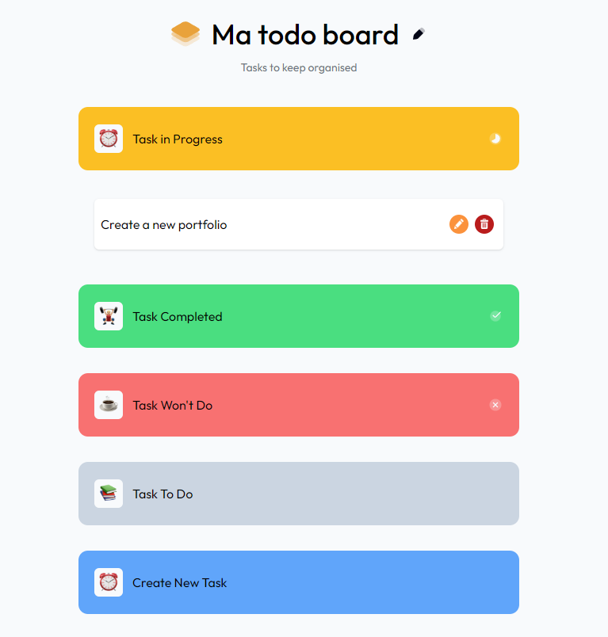

# My Task Board App

Welcome to **My Task Board App**, a task management application that allows you to organize your tasks by status: To Do, In Progress, Not To Do, and Completed. It's designed to help you keep track of your daily tasks efficiently.

<div align="center">
  
</div>

## Table of Contents

- [Introduction](#introduction)
- [Features](#features)
- [Installation](#installation)
- [Technologies](#technologies)
- [Usage](#usage)
- [License](#license)

## Introduction

This task board app is a simple yet effective tool to manage your tasks in various states. It provides an easy-to-use interface for adding, moving, and completing tasks. You can view your tasks in four distinct columns:

- **To Do**: Things you need to do.
- **In Progress**: Tasks you're currently working on.
- **Not To Do**: Things you've decided not to do.
- **Completed**: Tasks you've finished.

## Features

- **Collapsible Tabs**: Tabs automatically close when another is opened, keeping the interface organized and easy to navigate.
- **Real-Time Task Updates**: Instant task updates without refreshing the page.
- **Intuitive Design**: A clean and responsive layout for a seamless user experience.

## Installation

To run this project locally, follow these steps:

1. Clone the repository:

   ```bash
   git clone https://github.com/Andy-Vasseur/my-task-board.git
   ```

2. Navigate to the project folder:

   ```bash
   cd my-task-board
   ```

3. Install the dependencies:

   ```bash
   npm install
   ```

4. Run the development server:
   ```bash
   npm start
   ```

The app will now be running on `http://localhost:5173`.

## Technologies

- **ReactJS**: A JavaScript library used for building user interfaces.
- **TypeScript**: A strongly typed programming language that builds on JavaScript, ensuring type safety and cleaner code.
- **CSS/SCSS**: Cascading Style Sheets (CSS) and Sassy CSS (SCSS) for styling the application.
- **Node.js**: A JavaScript runtime used to run the development environment and build processes.
- **ViteJS**: A fast build tool and development server for modern web applications.

## Usage

Once the project is running locally, you can:

- **Add Tasks**: Use the input field to create new tasks.
- **Manage Tasks**: Drag tasks between the four categories.
- **Delete Tasks**: Remove tasks once they're no longer needed.

To create a production build, run:

```bash
yarn run build
```

This will generate a production-ready build in the `build/` directory.

## License

MIT License

Copyright (c) 2024 Andy Vasseur

Permission is hereby granted, free of charge, to any person obtaining a copy of this software and associated documentation files (the "Software"), to deal in the Software without restriction, including without limitation the rights to use, copy, modify, merge, publish, distribute, sublicense, and/or sell copies of the Software, and to permit persons to whom the Software is furnished to do so, subject to the following conditions:

The above copyright notice and this permission notice shall be included in all copies or substantial portions of the Software.

THE SOFTWARE IS PROVIDED "AS IS", WITHOUT WARRANTY OF ANY KIND, EXPRESS OR IMPLIED, INCLUDING BUT NOT LIMITED TO THE WARRANTIES OF MERCHANTABILITY, FITNESS FOR A PARTICULAR PURPOSE AND NONINFRINGEMENT. IN NO EVENT SHALL THE AUTHORS OR COPYRIGHT HOLDERS BE LIABLE FOR ANY CLAIM, DAMAGES OR OTHER LIABILITY, WHETHER IN AN ACTION OF CONTRACT, TORT OR OTHERWISE, ARISING FROM, OUT OF OR IN CONNECTION WITH THE SOFTWARE OR THE USE OR OTHER DEALINGS IN THE SOFTWARE.
